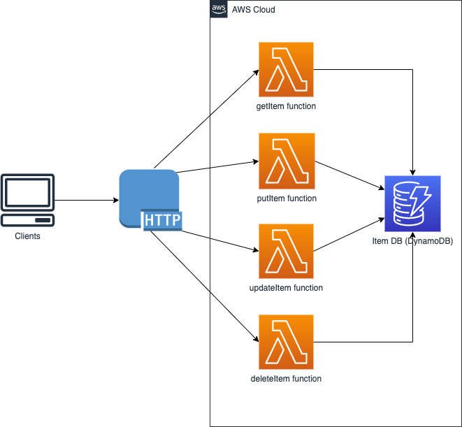

# App

The application is a CRUD API with Lambda handlers implemented using Java. Its architecture is in the picture given below.




## Prerequisites
- Java 11 (Amazon Corretto)
- Apache Maven
- [AWS SAM CLI](https://docs.aws.amazon.com/serverless-application-model/latest/developerguide/serverless-sam-cli-install.html)

## Development

The Lambda Handlers implement the [Amazon API Gateway payload format version 2.0](https://docs.aws.amazon.com/apigateway/latest/developerguide/http-api-develop-integrations-lambda.html#http-api-develop-integrations-lambda.proxy-format).
It is a requirement for invocation of the functions by URL as described in [AWS Lambda Developer guide](https://docs.aws.amazon.com/lambda/latest/dg/urls-invocation.html#urls-payloads).

#### Building the application
```
sam build
```

#### Testing it locally
```
sam local invoke
```

#### Adding more SDK clients
To add more service clients, you need to add the specific services modules in `pom.xml` and create the clients in `DependencyFactory` following the same 
pattern as dynamoDbClient.

## Deployment

The project contains a [SAM template](https://docs.aws.amazon.com/serverless-application-model/latest/developerguide/sam-resource-function.html) file `template.yaml` where you can 
configure different properties of lambda functions such as memory size and timeout. You might also need to add specific policies to the lambda function
so that it can access other AWS resources.

To deploy the application, you can run the following command:

```
sam deploy --guided
```

See [Deploying Serverless Applications](https://docs.aws.amazon.com/serverless-application-model/latest/developerguide/serverless-deploying.html) for more info.


